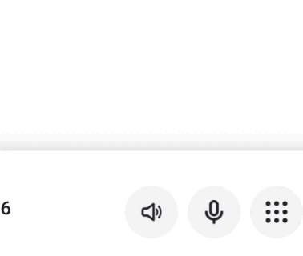

# Output Route Selector

A Flutter plugin that provides native audio output selection UI for iOS and Android.

## Demo

| iOS | Android |
|:---:|:-------:|
|  |  |

## Features

- **Native UI** - iOS UIMenu with blur effect, Android popup dialog
- **Automatic device detection** - Speaker, Receiver, Bluetooth, Wired Headset
- **Native icons** - SF Symbols on iOS, Material icons on Android
- **Real-time updates** - Stream notifications when audio route changes
- **Theme support** - Light/Dark mode on Android
- **Live dialog updates** - Android dialog updates in real-time when devices connect/disconnect

## Important Notes

### iOS Audio Session Sandbox

On iOS, this plugin can only control audio routes for audio sessions created by your app. You cannot control audio from other applications (e.g., Spotify, Apple Music). This is an iOS system limitation - each app has its own audio session sandbox.

To use this plugin effectively on iOS, make sure your app is playing or recording audio using AVAudioSession.

## Installation

```yaml
dependencies:
  output_route_selector: ^2.1.0
```

## iOS Setup

Add to your `Info.plist`:

```xml
<key>NSMicrophoneUsageDescription</key>
<string>Required for audio routing</string>
```

Minimum iOS version: **14.0**

## Usage

### 1. Add the Widget

```dart
import 'package:output_route_selector/output_route_selector.dart';

// With Icon
AudioOutputSelector(
  child: Icon(Icons.volume_up, size: 24),
)

// With AssetGenImage
AudioOutputSelector(
  child: Assets.icons.speaker.image(width: 24, height: 24),
)

// With custom widget
AudioOutputSelector(
  child: Container(
    width: 44,
    height: 44,
    decoration: BoxDecoration(
      color: Colors.blue.withOpacity(0.1),
      borderRadius: BorderRadius.circular(22),
    ),
    child: Icon(Icons.speaker, color: Colors.blue),
  ),
)
```

### 2. Listen to Events

```dart
OutputRouteSelector.instance.onAudioRouteChanged.listen((device) {
  if (device != null) {
    print('Active: ${device.outputName}');
    print('Type: ${device.deviceType}');
  }
});
```

## Complete Example

```dart
import 'dart:async';
import 'package:flutter/material.dart';
import 'package:output_route_selector/output_route_selector.dart';

class AudioDemo extends StatefulWidget {
  @override
  State<AudioDemo> createState() => _AudioDemoState();
}

class _AudioDemoState extends State<AudioDemo> {
  StreamSubscription<AudioModel?>? _subscription;
  String _currentDevice = 'Unknown';

  @override
  void initState() {
    super.initState();
    _subscription = OutputRouteSelector.instance.onAudioRouteChanged.listen((device) {
      if (device != null) {
        setState(() {
          _currentDevice = device.outputName;
        });
      }
    });
  }

  @override
  void dispose() {
    _subscription?.cancel();
    super.dispose();
  }

  @override
  Widget build(BuildContext context) {
    return Column(
      mainAxisAlignment: MainAxisAlignment.center,
      children: [
        AudioOutputSelector(
          size: 64,
          child: Container(
            width: 64,
            height: 64,
            decoration: BoxDecoration(
              color: Colors.blue.withOpacity(0.1),
              borderRadius: BorderRadius.circular(32),
            ),
            child: Icon(Icons.volume_up, size: 32, color: Colors.blue),
          ),
        ),
        SizedBox(height: 16),
        Text('Current: $_currentDevice'),
      ],
    );
  }
}
```

## API Reference

### AudioOutputSelector

| Parameter | Type | Description |
|-----------|------|-------------|
| `child` | `Widget` | The widget to display as button |

The widget automatically takes the size of its child.

### OutputRouteSelector

| Property | Description |
|----------|-------------|
| `instance` | Singleton instance |
| `onAudioRouteChanged` | Stream of `AudioModel?` - the active device |

### AudioModel

| Property | Type | Description |
|----------|------|-------------|
| `title` | `String` | Device identifier |
| `isActive` | `bool` | Whether device is active |
| `deviceType` | `AudioDeviceType` | Type of device |
| `outputName` | `String` | User-friendly name |

### AudioDeviceType

- `speaker` - Built-in speaker
- `receiver` - iPhone earpiece
- `wiredHeadset` - Wired headphones
- `bluetooth` - Bluetooth device

## Menu Icons

| Device | Icon |
|--------|------|
| Speaker | `speaker.wave.2.fill` |
| iPhone | `iphone` |
| Headphones | `headphones` |
| AirPods | `airpodspro` |
| Other Bluetooth | Custom SVG / `hifispeaker.fill` |

## Platform Support

| Platform | Status | Notes |
|----------|--------|-------|
| iOS | ✅ Full support (14.0+) | Native UIMenu |
| Android | ✅ Full support (API 23+) | Native popup dialog |
| Web | ❌ Not supported | N/A |

## Android Setup

Add to your `AndroidManifest.xml`:

```xml
<uses-permission android:name="android.permission.BLUETOOTH" />
<uses-permission android:name="android.permission.BLUETOOTH_CONNECT" />
```

## License

MIT License - see LICENSE file
